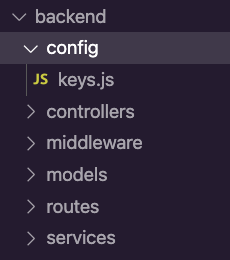
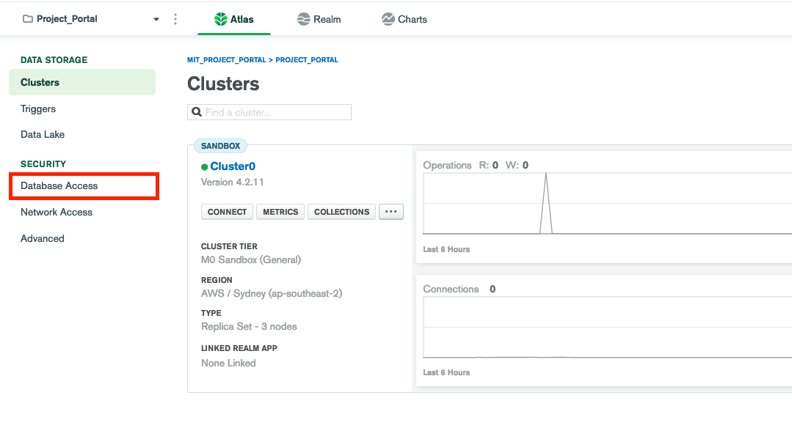
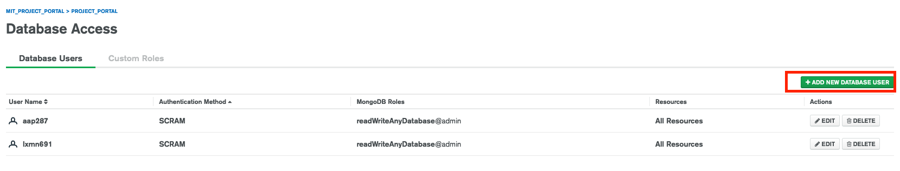
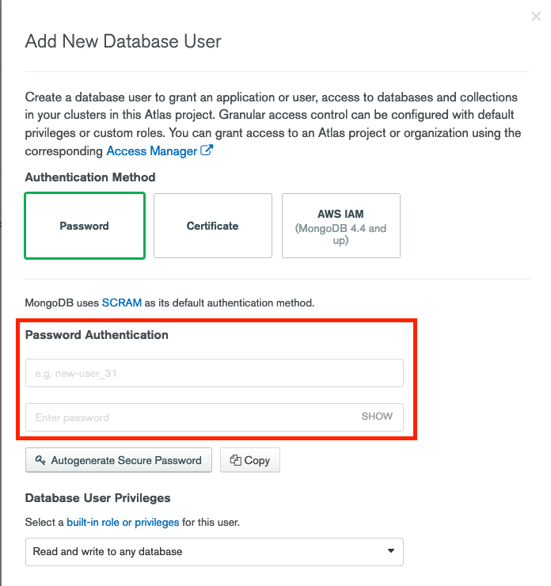

# MIT Project Portal

This is the group repo of MIT project portal web project.

## Get Started

### Backend code

#### 1. Install all dependencies

```bash
# in root directory
cd mit_project_portal
npm install
```

#### 2. Create config/keys and add mongodb atlas URL

- create a folder named `config` in the `backend` folder.
- create a file called `keys.js` inside the `config` folder.
- The folder structure should look like this:



#### 3. Create your username and password on [mongodb atlas](https://cloud.mongodb.com). Check your email for mongodb atlas invitation. Once complete the registration, you can access the project.

- Go to `*Database Access*` on the left hand side menu.

  

- Click `*ADD NEW DATABASE USER*` button on the far right.

  

- On the popup, leave other options like this, add a username and a password at your choice to the _Password Authetication_ section. Then click the `Add User` button on the bottom.

  

#### 4. Add the following code in `keys.js`, replace the relevant characters with your mongodb atlas credentials.

- Replace the `<mgdb_atlas_username>` with your user name on mongodb atlas
- Replace the `<mgdb_atlas_password>` with your password on mongodb atlas

```js
module.exports = {
  mongoURI:
    "mongodb+srv://<mgdb_atlas_username>:<mgdb_atlas_password>@cluster0.0tkta.mongodb.net/dev?retryWrites=true&w=majority",
};
```

#### 5. Start the development server

```bash
# in root directory
npm run start
```

### Frontend code

1. go to frontend folder

```bash
# in root directory
cd frontend
```

2. install frontend dependencies

```bash
# in frontend directory
npm install
```

2. Start the development server

```bash
# in frontend directory
npm run start
```
